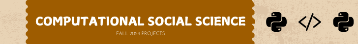

{.banner}

## PROJECT 1 - CSS - FALL 2024

Project 1 for my Fall 2024 Computational Social Science class was more insightful than expected. It involved setting up a project repository, working in teams on collaborative repositories and branches, and creating a website, which was my favorite part. While I exceeded the assignment's requirements out of excitement, the most challenging part was copying and pasting code, though I hope to find more efficient methods as the course progresses.  
  
  
[Project 1 Assignment File](Computational_Social_Science_Project_1__fa24_.pdf)

